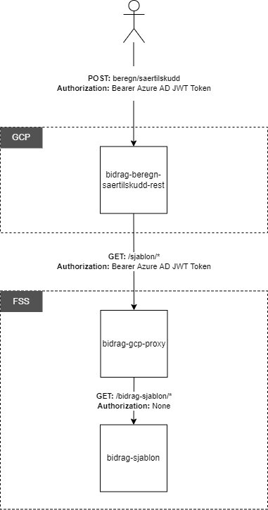

# bidrag-beregn-saertilskudd-rest

Mikrotjeneste / Rest-API for beregning av særtilskudd som er satt opp til å kjøre på NAIS i GCP.

### Tilgjengelige tjenester (endepunkter)
Request-URL: [https://bidrag-beregn-saertilskudd-rest.dev.intern.nav.no/beregn/saertilskudd](https://bidrag-beregn-saertilskudd-rest.dev.intern.nav.no/beregn/saertilskudd)
Swagger-UI: [https://bidrag-beregn-saertilskudd-rest.dev.intern.nav.no/](https://bidrag-beregn-saertilskudd-rest.dev.intern.nav.no/)

### Input/output
Tjenesten kalles med en POST-request, hvor input-dataene legges i request-bodyen. For nærmere detaljer, se Swagger.

### Avhengigheter
`bidrag-beregn-saertilskudd-rest` kaller maven-modul `bidrag-beregn-saertilskudd-core`, hvor selve beregningen gjøres.
Sjablonverdier hentes ved å kalle rest-tjenesten `bidrag-sjablon` via proxy tjenesten `bidrag-gcp-proxy`.

### Sikkerhet
Tjenesten er sikret med Azure AD JWT tokens. Konsumenter av tjenesten er derfor nødt til å registere seg som konsument av tjenesten, og benytte gyldig token i `Authorization` header ved REST-kall. Dersom en ny applikasjon skal ha tilgang må dette også registreres i henholdsvis `nais.yaml` og `nais-p.yaml` i denne applikasjonen.

### Funksjonalitet
Tjenesten tar inn parametre knyttet til bidragsmottaker, bidragspliktig og bidragsbarn. Eksempler på inputdata er inntekter, bostatus og løpende
bidrag. Det gjøres input-kontroll på dataene. Hvis noen av disse inneholder null, kastes `UgyldigInputException`, som resulterer i statuskode 
400 (Bad Request).

Sjablonverdier som er nødvendige for beregningen hentes fra tjenesten `bidrag-sjablon` via proxy tjenesten `bidrag-gcp-proxy`. Ved feil i kall for henting av sjablonverdier kastes `BidragGcpProxyConsumerException`, som resulterer i statuskode 500 (Internal Server Error).

Det gjøres en mapping fra rest-tjenestens input-grensesnitt til core-tjenestens input-grensesnitt før denne kalles. Output fra enkelte av
delberegningene brukes som input i andre delberegninger. Beregningsmodulen (core) kan også returnere feil, som vil resultere i at det kastes en
exception (avhengig av type feil).

**Det foretas følgende delberegninger:**
* Bidragsevne
* BP's andel av særtilskudd
* Samværsfradrag
* Særtilskudd (otalberegning)

For hver delberegning returneres resultatet av beregningen og grunnlaget for beregningen

### Overordnet arkitektur

### Integrasjonstester
Det er lagt inn integrasjonstester (BeregnSaertilskuddControllerIntegrationTest.java) vha. Junit- og WireMock-rammeverkene. Disse testene er ment å
dekke et bredt spekter av scenarier med tanke på særtilskuddsberegning.
